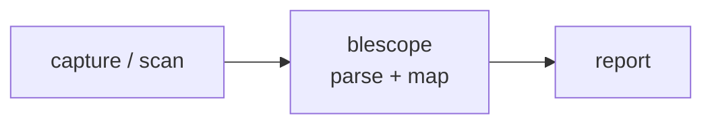

<a name="top"></a>
<div align="center">


# BLESCOPE

### Sniff and decode BLE GATT traffic, fingerprint device profiles, and assert on insecure pairing/characteristics in CI against a capture.


[](https://pypi.org/project/cognis-blescope/) [](https://github.com/cognis-digital/blescope/actions) [](LICENSE) [](https://github.com/cognis-digital)

*IoT / OT / Embedded — firmware, buses, and device security.*

</div>

```bash
pip install cognis-blescope
blescope scan capture.json    # → prioritized findings in seconds (passive, offline)
```

## Usage — step by step

`blescope` decodes a BLE GATT capture, fingerprints the device profile, and asserts on insecure pairing/access.

1. **Install** (Python 3.10+):
   ```bash
   pip install -e .            # or: pipx install blescope
   ```
2. **Scan a capture** (human-readable report):
   ```bash
   blescope scan demos/01-basic/frontdoor_lock.json
   ```
3. **Filter to actionable findings** at/above a severity:
   ```bash
   blescope scan capture.json --min-severity medium
   ```
4. **Read the output** as JSON for piping / dashboards, or **SARIF** for code-scanning:
   ```bash
   blescope scan capture.json --format json | jq '.findings'
   blescope scan capture.json --format sarif > blescope.sarif   # GitHub code-scanning
   cat capture.json | blescope scan -      # stdin
   ```
5. **Gate CI on insecure devices** — exit `1` when any actionable finding is reported, `0` when clean, `2` on usage error:
   ```yaml
   - run: pip install -e . && blescope scan capture.json   # non-zero fails the job
   ```

## Passive (default) vs Active (authorization-gated)

`blescope` has two modes. **Passive is the default and the safe one.**

### Passive — `blescope scan` (offline, no radio, no network)
Analyzes a capture **you provide** (a JSON or text GATT capture, a saved sniff,
an SBOM-style device inventory). It never opens a radio or contacts anything.
This is what runs in CI.

```bash
blescope scan capture.json                 # offline analysis of provided input
cat capture.json | blescope scan -         # stdin
```

### Active — `blescope scan-live` (live device pull) ⚠️ AUTHORIZED USE ONLY

> **⚠️ AUTHORIZED USE ONLY.** Active mode pulls *live* GATT data from a BLE
> device/adapter. Only probe devices **you own** or have **explicit written
> permission** to test. Active scanning of third-party devices may be illegal.

Active mode is engineered as a hard opt-in and is **OFF by default**:

- **`--authorized` is mandatory** — without it the command refuses (exit 2).
- **`--target-allowlist` is mandatory and non-empty** — a comma list of BLE
  addresses, or a path to a file of addresses, that are in scope. Devices not in
  the allowlist are **skipped, never probed**.
- **`--rate` rate-limits** every probe (default `1.0`/s; a token bucket paces it).
- A loud **"AUTHORIZED USE ONLY" banner** prints before any active operation.
- With no real BLE backend wired in, blescope **refuses rather than fabricate**
  data. Use `--demo` to exercise the active pipeline offline against bundled
  fixtures (no radio, no network).

```bash
# Refuses — active is off by default:
blescope scan-live --target-allowlist AA:BB:CC:DD:EE:01           # exit 2

# Authorized, scoped, rate-limited demonstration against bundled fixtures:
blescope scan-live --authorized \
                   --target-allowlist AA:BB:CC:DD:EE:01 \
                   --rate 1 --demo --format json
```

A real adapter backend (e.g. a `bleak`-based `Scanner`) is injected by the
operator; the bundled default never invents device data, and the test suite uses
only a `MockScanner`/localhost fixtures — never a real external host.

## Demos

Ten worked scenarios live in [`demos/`](demos/) — each is a real-format capture plus a `SCENARIO.md` (where the data came from, the exact run command, and how to act). Every demo is exercised by the test suite, so they always fire.

| Demo | Profile | Headline finding |
|---|---|---|
| [`01-basic`](demos/01-basic/) | smart_lock | Just Works + plaintext unlock write (**critical**) |
| [`02-clean`](demos/02-clean/) | fitness_tracker | clean baseline — zero findings, exit 0 |
| [`03-mixed`](demos/03-mixed/) | smart_lock | well-paired plug, leaky control characteristic |
| [`04-debug-keys`](demos/04-debug-keys/) | smart_lock | factory **debug keys** mask strong pairing |
| [`05-fitness-legacy`](demos/05-fitness-legacy/) | fitness_tracker | LE Legacy Pairing (no Secure Connections) |
| [`06-hid-keyboard`](demos/06-hid-keyboard/) | hid_peripheral | `NoInputNoOutput` forces Just Works on a keyboard |
| [`07-no-smp-sensor`](demos/07-no-smp-sensor/) | environmental_sensor | no SMP exchange — unencrypted link |
| [`08-beacon-open`](demos/08-beacon-open/) | beacon | proximity beacon left connectable + open |
| [`09-secure-lock`](demos/09-secure-lock/) | smart_lock | a lock done right — clean reference |
| [`10-text-relay`](demos/10-text-relay/) | smart_lock | tolerant **text-capture** format, full insecure stack |

```bash
python -m blescope scan demos/04-debug-keys/smartbulb_debugkey.json
python -m blescope scan demos/09-secure-lock/secure_deadbolt.json   # exits 0
```


## Contents

- [Why blescope?](#why) · [Features](#features) · [Quick start](#quick-start) · [Example](#example) · [Edge / air-gap](#edge) · [Architecture](#architecture) · [AI stack](#ai-stack) · [How it compares](#how-it-compares) · [Integrations](#integrations) · [Install anywhere](#install-anywhere) · [Related](#related) · [Contributing](#contributing)

<a name="why"></a>
## Why blescope?

Smart-lock and wearable teardown culture — 'this $200 lock pairs Just-Works and exposes a writable unlock characteristic' is endlessly shareable; reproducible from a saved capture.

`blescope` is single-purpose, scriptable, and self-hostable: point it at a target, get prioritized results in the format your workflow already speaks (table · JSON · SARIF), gate CI on it, and let agents drive it over MCP.

<div align="right"><a href="#top">↑ back to top</a></div>

<a name="features"></a>
## Features

- ✅ Decode GATT service/characteristic UUIDs (16-bit + Bluetooth-base 128-bit)
- ✅ Load captures from JSON **or** a tolerant `key: value` text form (and stdin)
- ✅ Fingerprint device profile (smart_lock · fitness_tracker · beacon · hid_peripheral · environmental_sensor)
- ✅ Audit SMP pairing (Just Works, LE Legacy, weak key, NoInputNoOutput, debug keys, missing SMP)
- ✅ Flag plaintext / unauthenticated writes to control characteristics
- ✅ `table` · `json` · **`sarif`** output (SARIF 2.1.0 for GitHub code-scanning)
- ✅ Privacy & bonding checks (static/public address tracking, unauthenticated bonded LTK)
- ✅ CI-ready exit codes with a `--min-severity` gate
- ✅ **Passive by default** (offline); optional **authorization-gated active** live pull (`scan-live`, OFF by default, scope-enforced, rate-limited)
- ✅ Runs on Linux/macOS/Windows · Docker · devcontainer
- ✅ Ports in Python, JavaScript, TypeScript, Go, Rust, **Perl, Ruby, and Shell+awk** (`ports/`) — passive core, CI-built, finding-ID parity verified against the reference

<div align="right"><a href="#top">↑ back to top</a></div>

<a name="quick-start"></a>
## Quick start

```bash
pip install cognis-blescope
blescope --version
blescope scan capture.json                       # passive: analyze a capture
blescope scan capture.json --format json         # machine-readable
blescope scan capture.json --min-severity high   # CI gate (non-zero exit)
```

<div align="right"><a href="#top">↑ back to top</a></div>

<a name="example"></a>
## Example

```text
$ blescope scan demos/01-basic/frontdoor_lock.json
============================================================
BLESCOPE report  (blescope 0.6.0)
============================================================
Device       : FrontDoorLock  [AA:BB:CC:DD:EE:FF]
Profile      : smart_lock  (confidence 100%)

Findings (6):
  [CRIT] SMP-JUSTWORKS: Just Works pairing (no MITM protection)
  [CRIT] ATT-PLAINTEXT-CTRL: Plaintext write to control characteristic 2a56
  [HIGH] SMP-LEGACY: LE Legacy Pairing (no Secure Connections)
  [HIGH] SMP-WEAKKEY: Short encryption key (7 bytes)
  [HIGH] GATT-UNAUTH-WRITE: Unauthenticated writable control characteristic 2a56
  [MED ] SMP-IOCAP: NoInputNoOutput I/O capability forces Just Works
------------------------------------------------------------
VERDICT: INSECURE   (worst severity: critical)
------------------------------------------------------------
```

### JSON output (for piping / dashboards)

```bash
$ blescope scan demos/01-basic/frontdoor_lock.json --format json | jq '.profile, .insecure, [.findings[].id]'
"smart_lock"
true
[
  "SMP-JUSTWORKS",
  "ATT-PLAINTEXT-CTRL",
  "SMP-LEGACY",
  "SMP-WEAKKEY",
  "GATT-UNAUTH-WRITE",
  "SMP-IOCAP",
  "SMP-WEAKBOND"
]
```

### SARIF output (for GitHub code-scanning)

`--format sarif` emits a SARIF 2.1.0 log: BLE severities map to `error`/`warning`/`note`,
each rule carries a CVSS-like `security-severity`, and the result is uploadable straight
to GitHub code-scanning.

```bash
$ blescope scan demos/01-basic/frontdoor_lock.json --format sarif | \
    jq '.runs[0].results[0] | {ruleId, level, security: .properties["ble-severity"]}'
{
  "ruleId": "SMP-JUSTWORKS",
  "level": "error",
  "security": "critical"
}
```

```yaml
# .github/workflows/ble-audit.yml — gate a PR on BLE captures
- run: pip install cognis-blescope
- run: blescope scan captures/device.json --format sarif > blescope.sarif
- uses: github/codeql-action/upload-sarif@v3
  with: { sarif_file: blescope.sarif }
```

<div align="right"><a href="#top">↑ back to top</a></div>

<a name="edge"></a>
## Edge / air-gap

`blescope` is built to run where there is no internet:

- **Zero network, zero telemetry.** The passive engine reads a local capture and
  nothing else — no feed fetch, no phone-home, no external lookups. UUID names,
  profile fingerprints, and pairing rules are all **bundled in the code**.
- **Stdlib-only Python core.** No third-party runtime dependency to vendor.
- **Most-portable ports for locked-down boxes.** The **Perl** port needs only the
  core `JSON::PP` (ships with Perl 5); the **Shell+awk** port needs only a POSIX
  shell and `awk`. Both are present on essentially every Unix host out of the box,
  so you can drop a single file onto an air-gapped analyst workstation and audit a
  capture with **nothing to install**.
- **Single-file deploy.** Copy `ports/perl/blescope.pl` or `ports/shell/blescope.sh`
  (+ `blescope.awk`) and run — no package manager, no virtualenv.

> blescope does **not** consume any external vulnerability/threat feed: its
> findings come entirely from the BLE/SMP specification rules and the Bluetooth SIG
> assigned-numbers tables compiled into the tool, so results are identical online
> or offline.

<div align="right"><a href="#top">↑ back to top</a></div>

<a name="architecture"></a>
## Architecture



<div align="right"><a href="#top">↑ back to top</a></div>

<a name="ai-stack"></a>
## Use it from any AI stack

`blescope` is interoperable with every popular way of using AI:

- **MCP server** — `blescope mcp` (Claude Desktop, Cursor, Cognis.Studio, [uncensored-fleet](https://github.com/cognis-digital/uncensored-fleet))
- **OpenAI-compatible / JSON** — pipe `blescope scan . --format json` into any agent or LLM
- **LangChain · CrewAI · AutoGen · LlamaIndex** — wrap the CLI/JSON as a tool in one line
- **CI / scripts** — exit codes + SARIF for non-AI pipelines

<div align="right"><a href="#top">↑ back to top</a></div>

<a name="how-it-compares"></a>
## How it compares

| | **Cognis blescope** | Sniffle + gattacker |
|---|:---:|:---:|
| Self-hostable, no account | ✅ | varies |
| Single command, zero config | ✅ | ⚠️ |
| JSON + SARIF for CI | ✅ | varies |
| MCP-native (AI agents) | ✅ | ❌ |
| Polyglot ports (JS/TS/Go/Rust/Perl/Ruby/Shell) | ✅ | ❌ |
| Air-gap single-file deploy | ✅ | ⚠️ |
| Open license | ✅ COCL | varies |

*Built in the spirit of **Sniffle + gattacker**, re-framed the Cognis way. Missing a credit? Open a PR.*

<div align="right"><a href="#top">↑ back to top</a></div>

<a name="integrations"></a>
## Integrations

Pipes into your stack: **SARIF** for code-scanning, **JSON** for anything, an **MCP server** (`blescope mcp`) for AI agents, and a webhook forwarder for SIEM/Slack/Jira. See [`docs/INTEGRATIONS.md`](docs/INTEGRATIONS.md).

<div align="right"><a href="#top">↑ back to top</a></div>

<a name="install-anywhere"></a>
## Install — every way, every platform

```bash
pip install "git+https://github.com/cognis-digital/blescope.git"    # pip (works today)
pipx install "git+https://github.com/cognis-digital/blescope.git"   # isolated CLI
uv tool install "git+https://github.com/cognis-digital/blescope.git" # uv
pip install cognis-blescope                                          # PyPI (when published)
docker run --rm ghcr.io/cognis-digital/blescope:latest --help        # Docker
brew install cognis-digital/tap/blescope                             # Homebrew tap
curl -fsSL https://raw.githubusercontent.com/cognis-digital/blescope/main/install.sh | sh
```

| Linux | macOS | Windows | Docker | Cloud |
|---|---|---|---|---|
| `scripts/setup-linux.sh` | `scripts/setup-macos.sh` | `scripts/setup-windows.ps1` | `docker run ghcr.io/cognis-digital/blescope` | [DEPLOY.md](docs/DEPLOY.md) (AWS/Azure/GCP/k8s) |

<div align="right"><a href="#top">↑ back to top</a></div>

<a name="related"></a>
## Related Cognis tools

- [`fwxray`](https://github.com/cognis-digital/fwxray) — Diff two firmware images and surface exactly what changed: new binaries, flipped config flags, added certs, and shifted entropy regions.
- [`canzap`](https://github.com/cognis-digital/canzap) — Replay, fuzz, and assert on CAN bus traffic from a .pcap or SocketCAN interface with a tiny YAML DSL.
- [`sbomb`](https://github.com/cognis-digital/sbomb) — Generate a CycloneDX SBOM directly from an unpacked firmware root filesystem and flag components with known CVEs and EOL kernels.
- [`mqttspy`](https://github.com/cognis-digital/mqttspy) — Passively map an MQTT broker: enumerate topics, detect unauthenticated writes, spot PII/secrets in payloads, and emit a risk report.
- [`uefiscan`](https://github.com/cognis-digital/uefiscan) — Audit UEFI firmware dumps for missing Secure Boot keys, unsigned modules, S3 boot-script vulns, and known SMM threats.
- [`modpot`](https://github.com/cognis-digital/modpot) — Spin up a high-interaction Modbus/DNP3 ICS honeypot that logs attacker register reads/writes as structured JSON.

**Explore the suite →** [🗂️ all 170+ tools](https://github.com/cognis-digital/cognis-neural-suite) · [⭐ awesome-cognis](https://github.com/cognis-digital/awesome-cognis) · [🔗 cognis-sources](https://github.com/cognis-digital/cognis-sources) · [🤖 uncensored-fleet](https://github.com/cognis-digital/uncensored-fleet) · [🧠 engram](https://github.com/cognis-digital/engram)

<div align="right"><a href="#top">↑ back to top</a></div>

<a name="contributing"></a>
## Contributing

PRs, new rules, and demo scenarios are welcome under the collaboration-pull model — see [CONTRIBUTING.md](CONTRIBUTING.md) and [SECURITY.md](SECURITY.md).

> ### ⭐ If `blescope` saved you time, **star it** — it genuinely helps others find it.

## Scope, authorization & safety

`blescope` is a **defensive, authorized-use** tool for engineers, researchers, and
security teams auditing devices **they own or are explicitly permitted to test**.

- **Passive by default.** `blescope scan` only reads a capture you already have. It
  never opens a radio, never contacts a network, and is what runs in CI.
- **Active mode is a hard opt-in.** `blescope scan-live` is **OFF by default** and
  refuses to run without `--authorized` **and** a non-empty `--target-allowlist`.
  Devices not on the allowlist are skipped, never probed; every probe is
  rate-limited; a loud "AUTHORIZED USE ONLY" banner prints first.
- **Read-only probes, no exploitation.** Active mode enumerates GATT and inspects
  pairing posture — it sends **no exploit payloads, no auth-bypass, no actuation
  writes**. It reports risk; it does not attack.
- **No fabricated data.** With no real BLE backend wired in, blescope **refuses
  rather than invent** device data. Tests use only local fixtures / `MockScanner`.
- **You are responsible** for ensuring you have permission. Active scanning of
  third-party devices may be illegal in your jurisdiction.

## Interoperability

`blescope` composes with the 300+ tool Cognis suite — JSON in/out and a shared
OpenAI-compatible `/v1` backbone. See **[INTEROP.md](INTEROP.md)** for the
suite map, composition patterns, and reference stacks.

## License

Source-available under the **Cognis Open Collaboration License (COCL) v1.0** — free for personal, internal-evaluation, research, and educational use; **commercial / production use requires a license** (licensing@cognis.digital). See [LICENSE](LICENSE).

---

<div align="center"><sub><b><a href="https://cognis.digital">Cognis Digital</a></b> · one of 170+ tools in the <a href="https://github.com/cognis-digital/cognis-neural-suite">Cognis Neural Suite</a> · <i>Making Tomorrow Better Today</i></sub></div>
